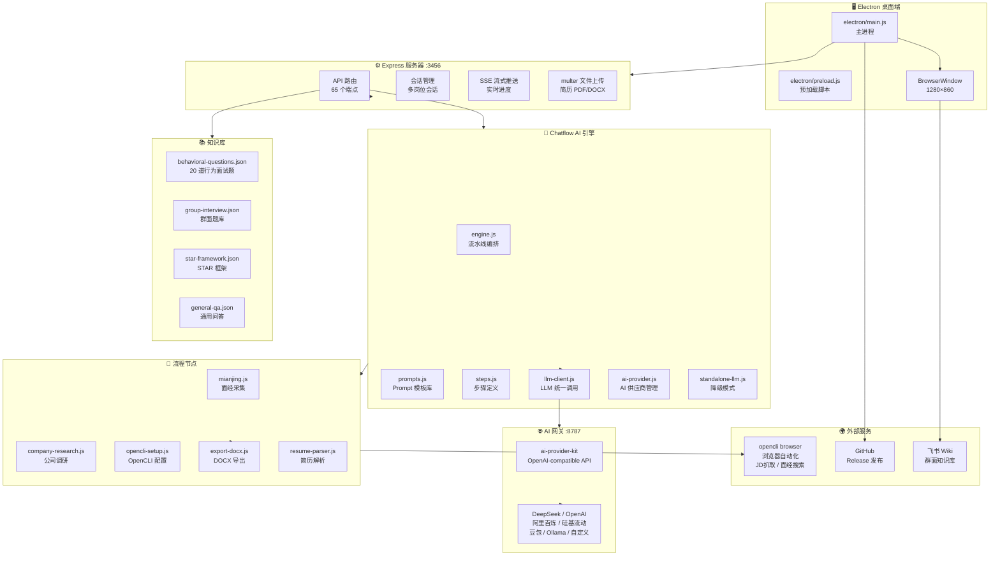
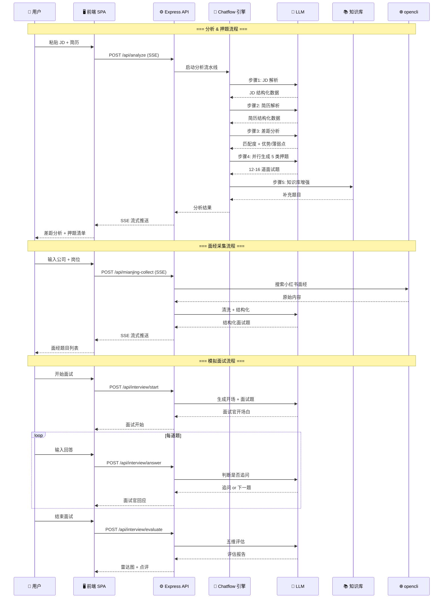
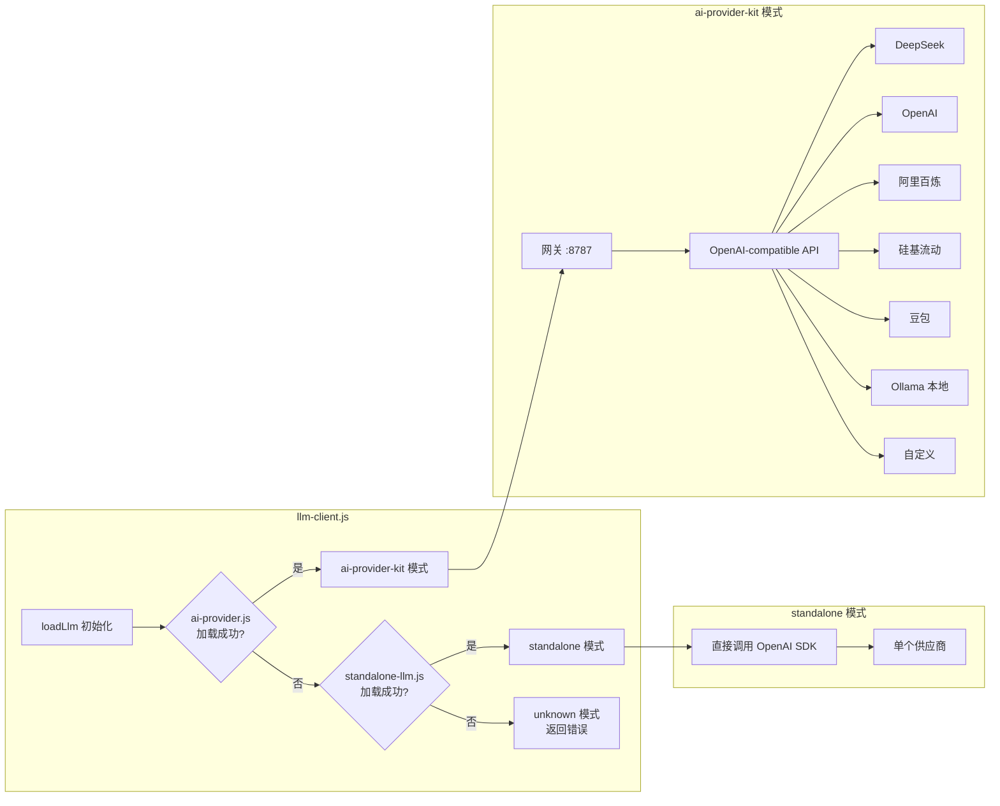
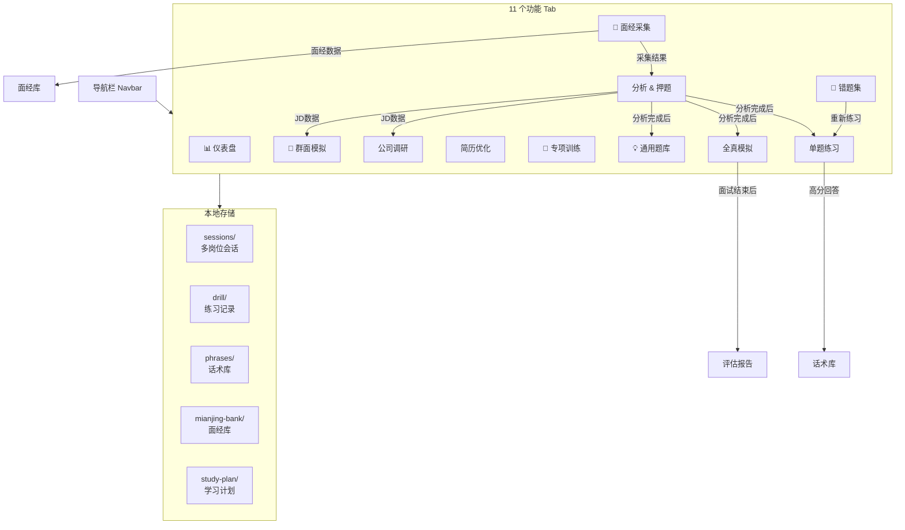

# 项目架构

> 最后更新：2026-07-26 | v1.6.0

---

## 一、技术栈总览

| 层级 | 技术 | 版本 |
|------|------|------|
| 桌面框架 | Electron | 33.3 |
| 后端服务 | Express (Node.js) | 4.21 |
| 前端 | Vanilla JS + ECharts | — |
| 样式 | CSS 自定义属性（亮色/暗色双主题） | — |
| AI 网关 | ai-provider-kit (OpenAI-compatible) | — |
| 浏览器自动化 | opencli browser | 1.8.6 |
| 文档解析 | pdf-parse / mammoth / tesseract.js | — |
| 文档生成 | docx (Office Open XML) | 9.7 |
| 打包 | electron-builder | 25.1 |

---

## 二、页面结构

```mermaid
graph TD
    A[📊 仪表盘 Dashboard] --> B[分析 & 押题]
    A --> C[单题练习]
    A --> D[全真模拟面试]
    A --> E[简历优化]
    A --> F[📡 面经采集]
    A --> G[🎯 专项训练]
    A --> H[💡 通用题库]
    A --> I[公司调研]
    A --> J[📝 错题集]
    A --> K[👥 群面模拟]

    B --> B1[JD 解析]
    B --> B2[简历解析]
    B --> B3[差距分析]
    B --> B4[押题生成]
    B --> B5[押题清单展示]

    C --> C1[选题作答]
    C --> C2[AI 评估 + 逐句点评]
    C --> C3[AI 标准答案参考]
    C --> C4[话术库收藏]

    D --> D1[AI 面试官开场]
    D --> D2[多轮追问]
    D --> D3[面试评估报告]
    D --> D4[面试历史回顾]

    E --> E1[简历评分]
    E --> E2[逐段优化建议]
    E --> E3[全文化化]
    E --> E4[自我介绍生成]

    F --> F1[小红书搜索]
    F --> F2[文字提取 + OCR]
    F --> F3[面经结构化]
    F --> F4[面经整合分析]

    G --> G1[题型过滤]
    G --> G2[计时器]
    G --> G3[历史记录]
    G --> G4[趋势图]

    K --> K1[题目生成]
    K --> K2[AI 候选人对话]
    K --> K3[群面评估报告]
    K --> K4[知识库参考]
```



---

## 三、系统架构



---

## 四、核心数据流



---

## 五、LLM 双后端架构



---

## 六、前端 Tab 组件关系



---

## 七、文件职责速查

```
InterviewPrep/
├── server.js              # Express 主服务，65 个 API 路由，SSE 流式推送
├── electron/
│   ├── main.js            # Electron 主进程，窗口管理，延迟启动网关
│   └── preload.js         # 预加载脚本，暴露安全的 IPC 接口
├── chatflow/
│   ├── engine.js          # 分析流水线编排（JD解析→简历解析→差距分析→押题生成）
│   ├── prompts.js         # 所有 LLM Prompt 模板（20+ 个 System Prompt）
│   ├── llm-client.js      # LLM 统一调用（ai-provider-kit / standalone 双后端）
│   ├── ai-provider.js     # AI 供应商连接管理（CRUD + 测试）
│   ├── standalone-llm.js  # 独立 LLM 降级模式
│   ├── conn-store.js      # 连接状态本地存储
│   ├── resume-parser.js   # 简历文件解析（PDF/DOCX/TXT → 文本）
│   ├── export-docx.js     # DOCX 文档生成（话术库/面经库导出）
│   └── nodes/
│       ├── mianjing.js     # 面经采集节点（opencli 搜索 + OCR + LLM 结构化）
│       ├── company-research.js  # 公司调研节点
│       └── opencli-setup.js     # OpenCLI 一键配置
├── public/
│   ├── index.html         # 单页应用主 HTML（11 个 Tab 区域）
│   ├── app.js             # 前端逻辑（~5000 行，状态管理 + API 调用 + UI 渲染）
│   ├── style.css          # 样式（亮色/暗色双主题，CSS 自定义属性）
│   ├── echarts.min.js     # ECharts 图表库（雷达图/饼图/热力图）
│   └── group-kb-embed.html # 群面知识库飞书嵌入页
├── knowledge/
│   ├── index.js           # 知识库搜索入口
│   ├── behavioral-questions.json  # 20 道通用行为面试题
│   ├── group-interview.json       # 群面讨论题库
│   ├── star-framework.json        # STAR 法则框架
│   └── general-qa.json            # 通用问答
├── .data/                 # 本地数据存储（JSON 文件，无数据库）
├── logs/                  # 错误日志
├── scripts/
│   └── gen-icon.js        # 图标生成脚本
├── TODO.md                # 实时任务清单
├── ARCHITECTURE.md        # 本文件
└── README.md              # 产品说明 + 启动指南
```